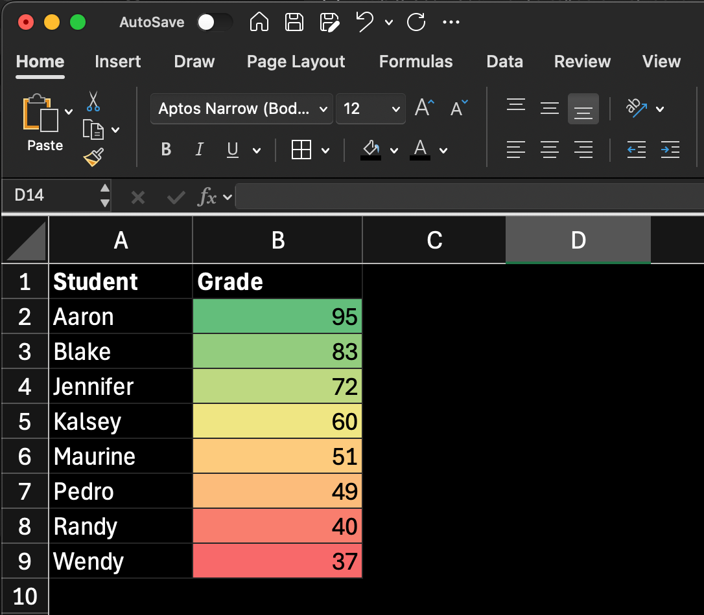
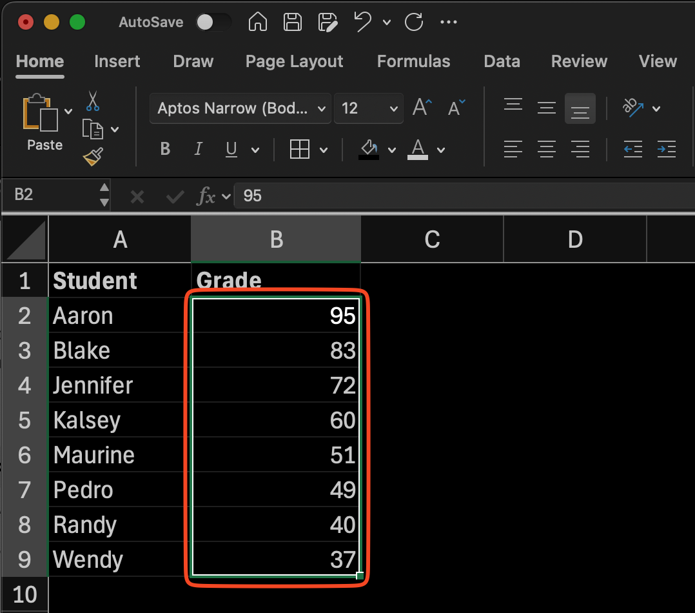
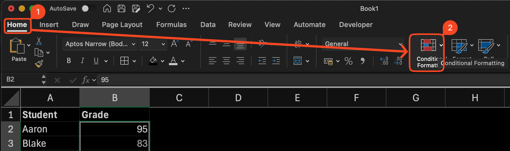
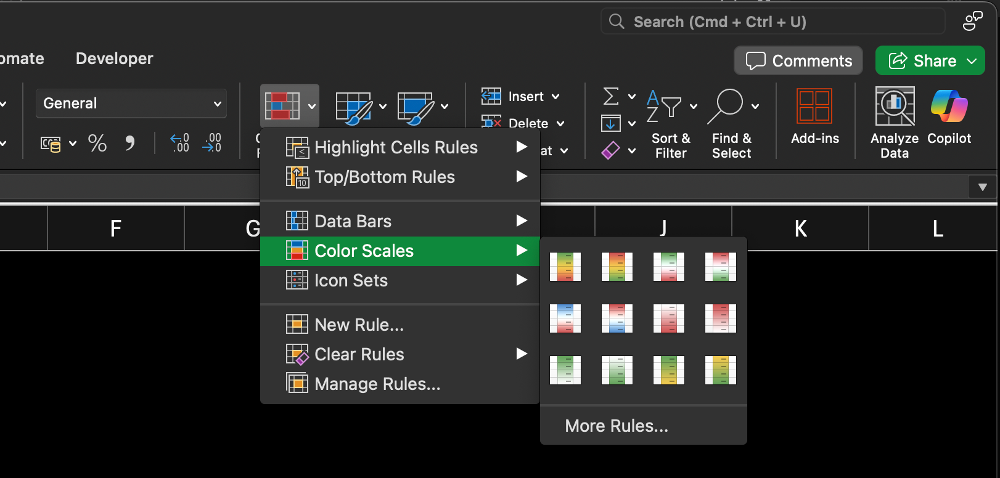

import InfoBox from '@/components/mdx/InfoBox.astro'
import Callout from '@/components/Callout.astro'

When analyzing data, our eyes are easier to see visual cues to see pattern in data. We can use color scales to see the value range between one data with another. In this tutorial, I'll show you how to use Color Scales to coloring cell based on Value in Microsoft Excel. 

<a href='https://vincentwidyan.gumroad.com/l/xmbjj'>

</a>
## Introduction
Coloring cell in Excel is as easy as select color on __Fill Cell__ option in __Home__ menu. But the issue happen if we have range of cells that we want to color, and we want they are dynamically change -- _in terms of saturation or luminosity_ -- based on the value of its cells.
We absolutely don't want to color them manually and change whenever the value change. So, we could use __Conditional Formatting__.

    

        
    

<Callout title='Pre-requisite' variant='important'>
Use Microsoft Excel, either you can purchase it with license or using free [Microsoft 365 Online](https://www.microsoft.com/en-us/microsoft-365/free-office-online-for-the-web#:~:text=Use%20Microsoft%20365%20apps%20for,the%20web%20(formerly%20Office).)
</Callout>

Conditional Formatting lets us change the property of the cell like fill color, text color, text character, or even adding icon, based on the value of its cell. It has several use cases as described on the table below.

| Options | Description |
| ---- | ----------- | 
| Color Scales | Change font or fill color based on the value range |
| Icon Sets | Add icons based on the value range |
| Highlight Cell Rules | Change color if the cell match with certain rule  | 
| Data Bars | Add progress bar inside the cell based on the value |

## Method
Here are the steps to color cells in [Microsoft Excel](https://excel.cloud.microsoft) based on value using __Color Scales__ in Conditional Formatting

1. __Select__ the range all of the data you want to color.

    

        
    

2. Go to __Home__, then select __Conditional Formatting__

3. Dropdown will appear, then select __Color Scales__, and you can select color you prefer. 

    

        
    

<Callout title='add midpoint color' variant="note">
If you want to dig deeper, we can select __More Rules...__ and then you'll find that we can use between __2-Color Scales__ and __3-Color Scales__. For __3-Color Scale__, we can add 1 color in the midpoint.
</Callout>

4. Your range of data will be colored based on its value

    

        
    

<Callout title='add max or min value' variant="tip">
By default, Color Scales will colors your data from highest to lowest value. If you want to define the higher and lowest value, you can go to __Conditional Formatting__ > __Manage Rules__ > __Edit Rule__ > Define the highest and lowest value > __OK__.
</Callout>

## Conclusion
By doing this steps, you should be successuflly coloring cells based on Value in [Microsoft Excel](https://excel.cloud.microsoft) using Color Scales in Conditional Formatting.
<a href='https://vincentwidyan.gumroad.com/l/xmbjj'>

</a>