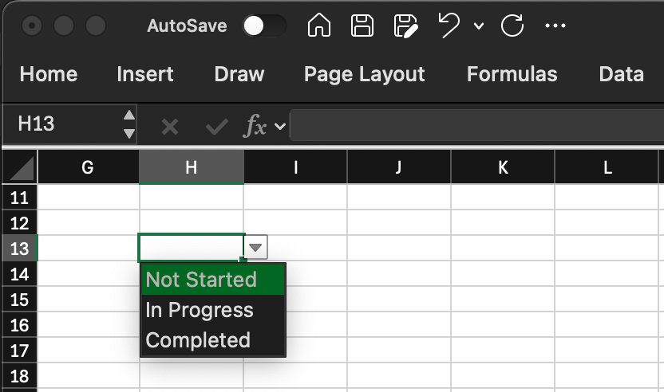
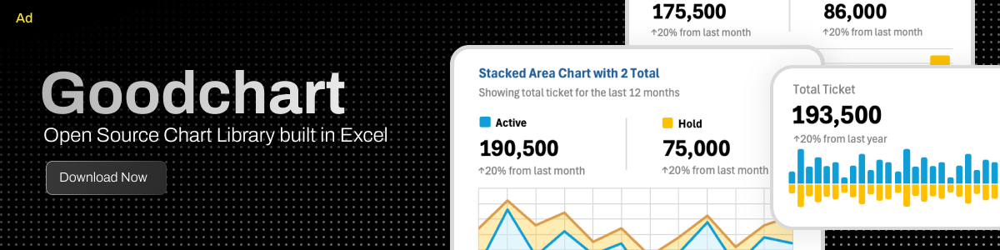
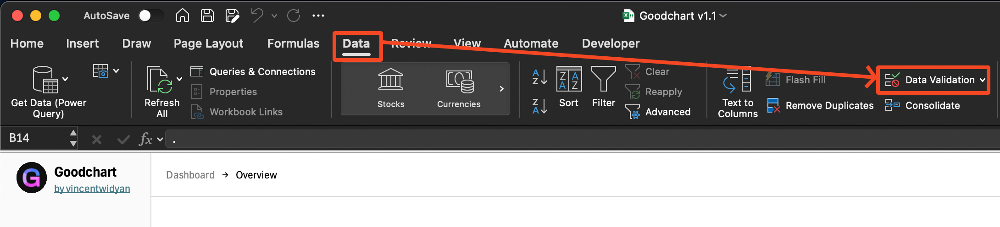
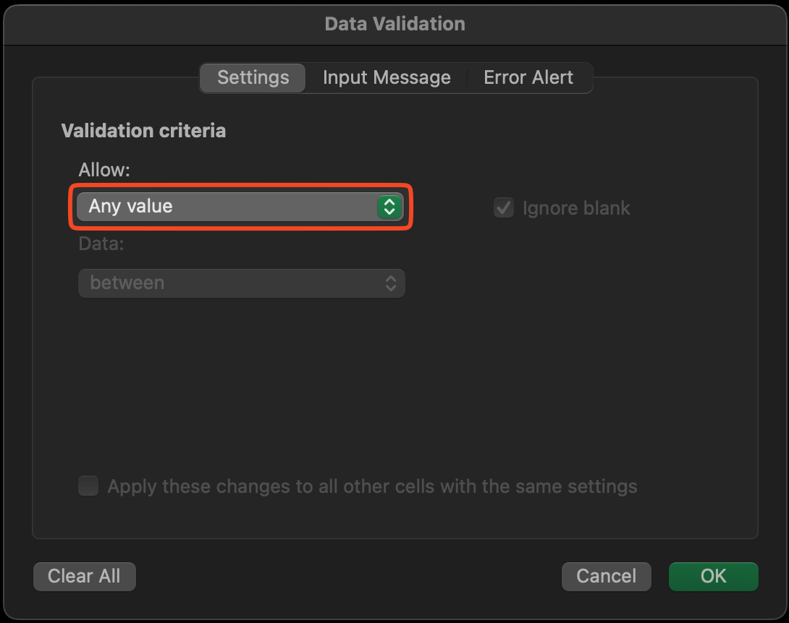
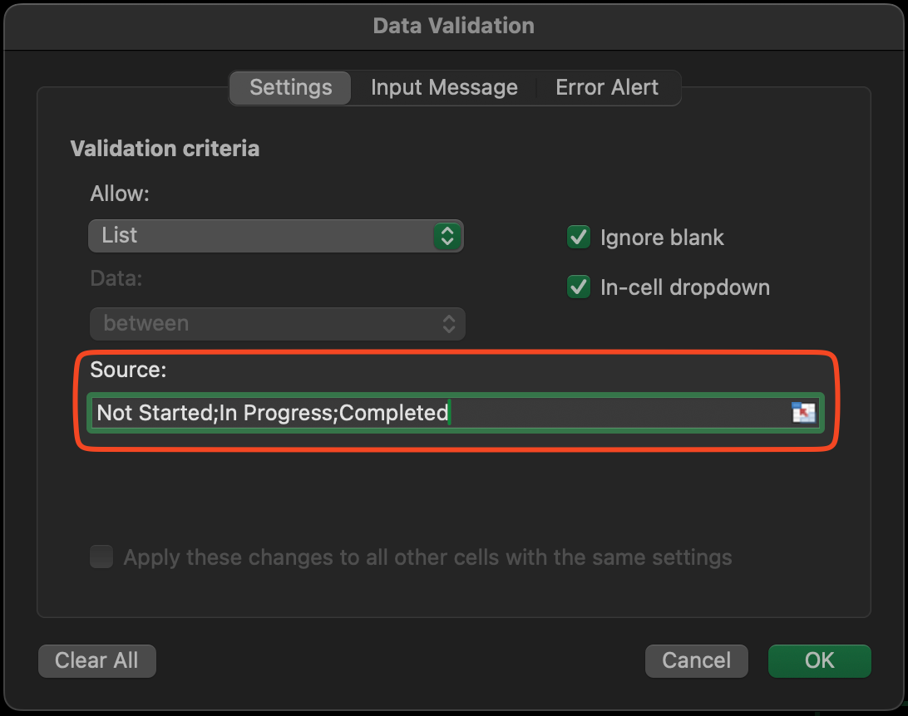

import InfoBox from '@/components/mdx/InfoBox.astro'
import Callout from '@/components/Callout.astro'
import { image1 } from '@/content/blog/create_dropdown_in_excel/banner2.png'

Data Validation feature in Microsoft Excel can be useful when you want to make sure other person that using your Excel won't messed up. Using Data Validation, we can define the options that allowed to input. In this tutorial, I will explain tutorial on how to create Dropdown using Data Validation in Microsoft Excel.

## Introduction
For those of you who are not familiar with dropdown, in Excel, we can __force some cells to be filled with certain value__ that we define in the beginning. The value can be number or text or even both. This is very handy if we are giving the spreadsheet to other person to fill, but we need to make sure the person is filling the spreadsheet as our requirements and will decrease the variant of that person's answers.

    

        
    

As you can see on the picture above, we can force the cell <kbd>H13</kbd> to be filled only either as <kbd>Not Started</kbd>, <kbd>In Progress</kbd>, or <kbd>Completed</kbd>. You cannot fill the cell except for those options. Later we have no worry if other person filling that cell outside of our expects.

<a href='https://vincentwidyan.gumroad.com/l/xmbjj'>

</a>

## Methods
There are actually 2 (two) main methods on creating dropwdown options in Excel which are directly define the options and using dynamic cells. In this tutorial, I will explain those 2 methods and the steps on how to do.
<Callout title='Pre-requisite' variant='important'>
Use Microsoft Excel, either you can purchase it with license or using free [Microsoft 365 Online](https://www.microsoft.com/en-us/microsoft-365/free-office-online-for-the-web#:~:text=Use%20Microsoft%20365%20apps%20for,the%20web%20(formerly%20Office).)
</Callout>

### 1. Directly define the options
When using this method, we put all the options into the source of Data Validation in the beginning. This is best method if we already know the options and will never intended to add more option in the future. It has __lower risk for being change by other user and create error__. But if someday we need to change - either add or remove - the options, we will need more effort to change all of the cells that have this Data Validation. 
So in summary:

| Action | Description |
| ---- | ----------- | 
| Pro | Has lower risk of error  | 
| Cons | More effort when add or remove upcoming option |

Here are the steps on how to create dropdown option in Excel using Data Validation by directly define the options:
1. Select the cell that you want dropdown options to apply
2. Go to __Data__ tab, then go to __Data Validation__. A pop up will appear.

3. Click the __Any Value__ under __Allow__ field then select options __List__ from __Allow__ dropdown

  

    
  

  

    
  

4. Fill the __Source__ with your options. Separate them using <kbd>,</kbd> comma, or <kbd>;</kbd> semicolon depending on you Excel settings. 

    

        
    

5. Click __OK__ to continue.

    

        
    

After click __OK__, you'll have dropdown options on your selected cell. You can not fill the cell except those option you define earlier.
You can copy this cell to other cell to copy the dropdown option.

### 2. Using dynamic cell reference
Another method to create dropdown options is by using dynamic cell reference. We can set any cells on the current spreadsheet as the options for the dropdown. Not only that, we can set also empty cells so that in the future we can put more options and the dropdown will automatically update.
But this method will have error if later the cells we refer are deleted or moved. So in summary:

| Action | Description |
| ---- | ----------- | 
| Pro | Has higher risk of error  | 
| Cons | Less effort when add or remove upcoming option |

Here are the steps on how to create dropdown option in Excel using Data Validation by using dynamic cell reference:
1. Select the cell that you want dropdown options to apply
2. Go to __Data__ tab, then go to __Data Validation__. A pop up will appear.

3. Click the __Any Value__ under __Allow__ field then select options __List__ from __Allow__ dropdown

  

    
  

  

    
  

4. Click the __Source__ field, then drag the range of cells we want to refer. The __Source__ field with filled with cell's range.

    

        
    

5. Click __OK__ to continue.

    

        
    

After click __OK__, like the previous method, you'll have dropdown options on your selected cell.

<Callout title='Add more options later' variant='tip'>
If you want to add more options later and don't want to change from the Data Validation configuration, you can spare more empty cells.
</Callout>

## Conclusion
By doing these steps, you should be successfully create dropdown using Data Validation in Microsoft Excel using 2 (two) method which are directly define and using dynamic cell reference. 

<a href='https://vincentwidyan.gumroad.com/l/xmbjj'>

</a>