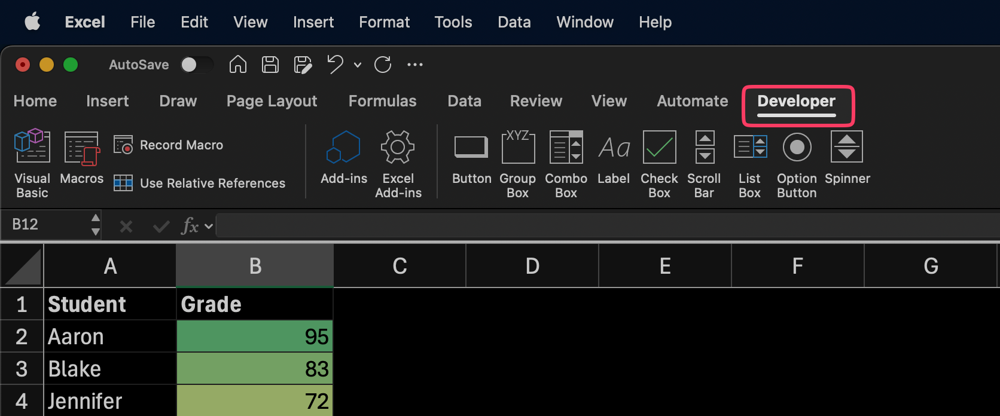
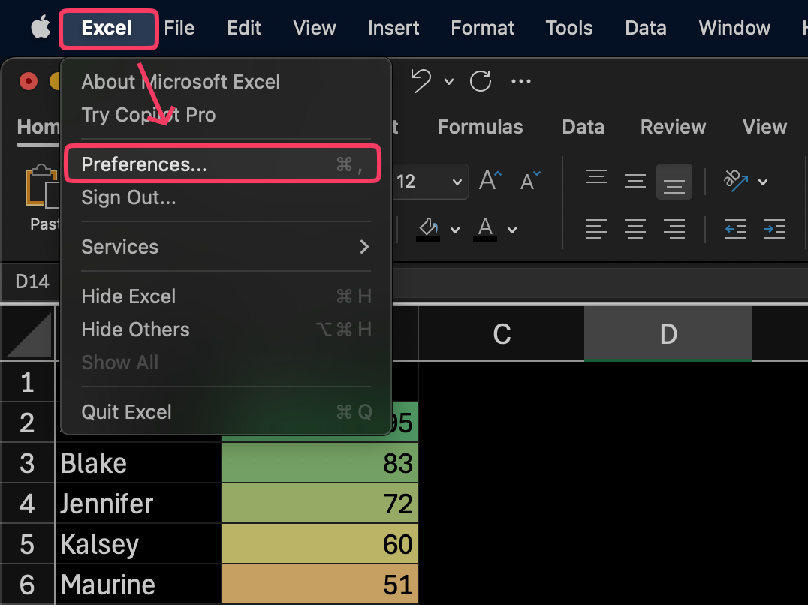
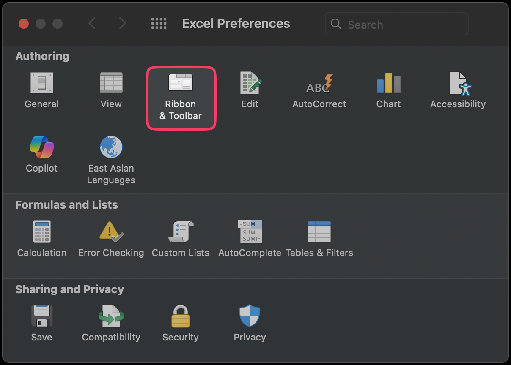
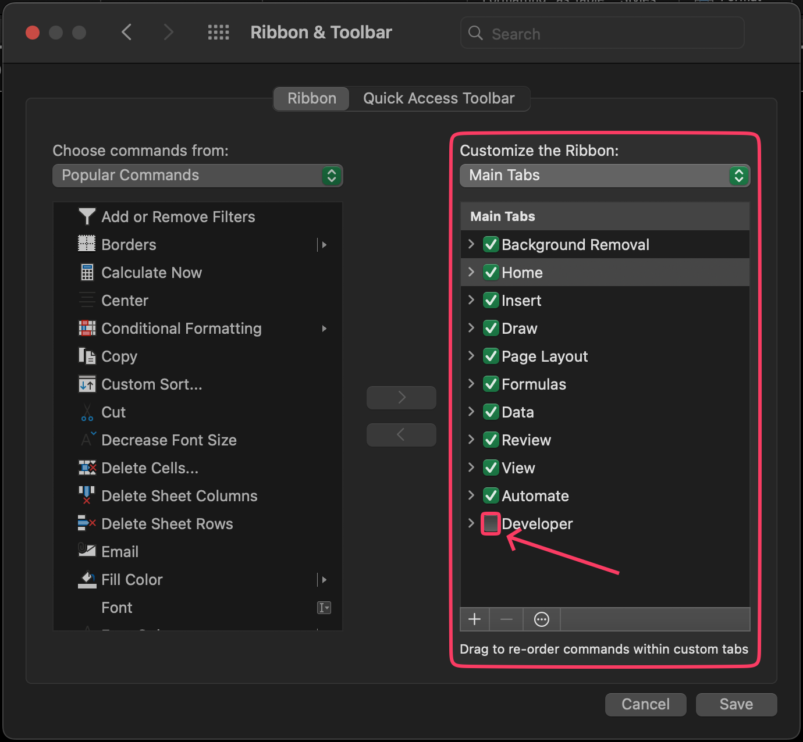

import InfoBox from '@/components/mdx/InfoBox.astro'
import Challenge from '@/components/mdx/Challenge.astro'
import { Icon } from 'astro-icon/components'
import Callout from '@/components/Callout.astro'

## Introduction

When you open Microsoft Excel for the first time, Developer tab is somewhat missing. I have no idea why but I suspect because mainly only superuser who is using this tab more often. But actually this hidden tab is pack with important features in Microsoft Excel. In this tutorial, I show you how you can enable/show Developer tab in Microsoft Excel.

        
    

## Benefits
You may wonder what are the benefits of enabling this feature or why we need to enable this Developer Tab in Excel or in the first place. But actually, this tab serves many purposes to improve our efficiency using Microsoft Excel. Here are some benefits of Developer Tab in Microsoft Excel:

| No | Usage |
| ---- | ----------- | 
| 1 | Record macro to automate repetitive tasks |
| 2 | Create automation with more flexible action |
| 3 | CAdd interactive widget like button, scroll bar, form box etc.  | 
| 4 | Add Excel Add-ins |

<Callout title='Pre-requisite' variant='important'>
- Use Microsoft Excel, either you can purchase it with license or using free [Microsoft 365 Online](https://www.microsoft.com/en-us/microsoft-365/free-office-online-for-the-web#:~:text=Use%20Microsoft%20365%20apps%20for,the%20web%20(formerly%20Office).)
</Callout>

<a href='https://vincentwidyan.gumroad.com/l/xmbjj'>

</a>

## Steps
Here are the steps on how to enable or show Developer Tab in Excel on Mac OS:
1. Go to __Excel__ menu on the top left of the screen, then select __Preferences__

    

        
    

2. New pop up __Excel Preferences__ will appear. On the Authoring section, click option __Ribbon & Toolbar__

    

        
    

4. On the right side of the windows, find the __Developer Tab__ check box and check if not yet checked. If you don't see the Developer Tab check box, scroll down until bottom.

    

        
    

5. Click __Save__ to continue.

        
    

After you save it, Developer Tab should appear on the Toolbar Menu right next to View Tab and that's how you can enable/show Developer tab in Microsoft Excel.

